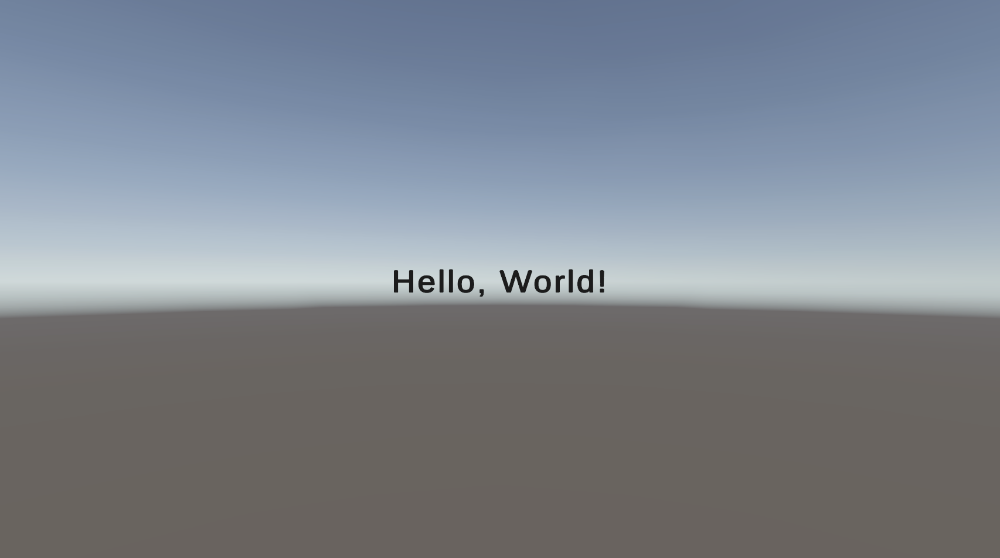

Now that we know a bit more about why UCGUI is the way it is you might be
wondering _"Ok cool, but how do I get a text or a button onto the screen? I know
how to do it via the editor and it is super fast so why would I even need 
this stupid libary?"_. That's a fair point, so I will show you now:

UCGUI separates its UIs into so called **Screens** which are essentially just 
a big content holder for all of your UI. Think of it like a mediation layer
between the canvas in your editor and your UI code. 
Instead of creating an empty GameObject for every UI elements manually and then adding 
it to the correct spot in the hierarchy you create your components inside of such a screen.

Let's create our first screen and add a 'Hello, World!' text to it. For that we need
a script which inherits from `SimpleScreen`. Screens should be the **only** scripts 
we actually assign and attach in the editor. 

First create a new MonoBehaviour script and name it 'MyScreen'.
Next add **import UCGUI** and inherit from the SimpleScreen class like so:

```csharp
using UCGUI;
using UnityEngine;

public class MyScreen : SimpleScreen
{
    // ... 
}
```

:::important

Before we implement the missing methods attach this script to a (preferrably empty) GameObject in 
the scene hierarchy which is **hierarchially below a Canvas**. If you don't have a canvas yet, please add
one. This is a **crucial step** and your UI will **not appear properly** if you have not
set this up correctly.

Your hierarchy would then look something like this:
```title="Hierarchy Example"
Scene Root
└─ Canvas 
    └─ Empty :: MyScreen
└─ ...
```


:::

Your IDE or Unity might already alert you that SimpleScreen requires some
members to be implemented. 
These should be three different methods: `Create`, `Initialize` and `GetCanvas`.

For our simple example we only need 'Create' and 'GetCanvas', you can simply leave 
'Initialize' empty. 

Now lets put 'Hello, World' onto the screen and I'll explain why and how this works afterwards.

```csharp
// ... class header ...

public override void Create(){
    UI.Text("Hello, World!").Parent(canvas);
}

// ...

public override void GetCanvas(){
    return gameObject.GetComponentInParent<Canvas>();
}
```

The 'Create' method might seem pretty straight forward. You create a TextComponent which
contains the desired string and parent it to the `canvas` reference. \
However where does this reference come from? This is where 'GetCanvas' comes in.
**You decide** how you want to return a valid canvas (if any). Searching for it 
in the parent is not optimal but a quick and easy solution if you have set up the hierarchy correctly.
This method will initialize the 'canvas' member, allowing 'Create' to access it.

If you now go into Play Mode you should see your text get drawn onto the screen, looking
something like this:


You might have already figured out that `UI.Text(string)` is a static builder to create 
a new GameObject with a TextComponent attached to it. \
This isn't enough though, you also need to parent the element to some place in the hierarchy, otherwise it will have 'null' as a parent
and it will be attached to the highest level of the scene hierarchy and not be visible.
`Parent(...)` can be used to prevent this, which parents the element to a given position in the hierarchy.
This is why earlier we first had to define what 'canvas' actually is, so we can later use it 
in our 'Create' method. You can pass most objects into 'Parent', allowing you to create
your hierarchy this way. If you are inside of a screen and want the object to be bound 
to the screen rather than to the top level canvas, simple use the `this` reference.

You might also be thinking _"Well this looks cool and all but the text is a bit small, it wraps weirdly
and I want it to be bold..."_. Again, fair argument but UCGUI offers solutions to 
all of your problems (_at least for this UI example, not in real life :/_).

This where the fluent pattern jumps in. UCGUI makes use of a generic extension class 
which allows all components to have certain shared function available to them. 'Parent' 
is one of them for example. However, some functions are also inside the classes themselves
and thus limited to their respective instances.

Let's expand on our previous example and address all of your hypothetical UI concerns:

```csharp
// ... 

public override void Create(){
    UI.Text("Hello, World!")
    .FitToContents()
    .FontSize(124)
    .Bold()
    .Parent(canvas);
}

// ...
```



_Ahhh_, much better! As you can see, the fluent pattern allows us to easily chain multiple
styling options without having to re-reference the object multiple times.

Here `FitToContents`, `FontSize` and `Bold` are TextComponent-specific, whereas 
'Parent' can be applied universally to any component.

'FitToContents' simply tells the rect of the text to adapt to the preferred 
size of the text itself, removing our weird line-wrap issues from before. 
'FontSize' and 'Bold' should be self-explanatory.

Perfect. Now we know how to display some basic text on the screen!
A small recap of what we have learnt so far:

- Screens server as a mediation layer between the editor and your UCGUI interface and can be initialized with a reference to the parent canvas.
- UCGUI uses the fluent pattern for almost all of the configuration of components, allowing for quick and simple modifications.
- The static `UI` class offers a lot of preset builders, like 'UI.Text(...)', for quick creation of UCGUI's default components.
- Setting the parent for any component is **crucial**! Do not forget it, otherwise your element might not be visible!
