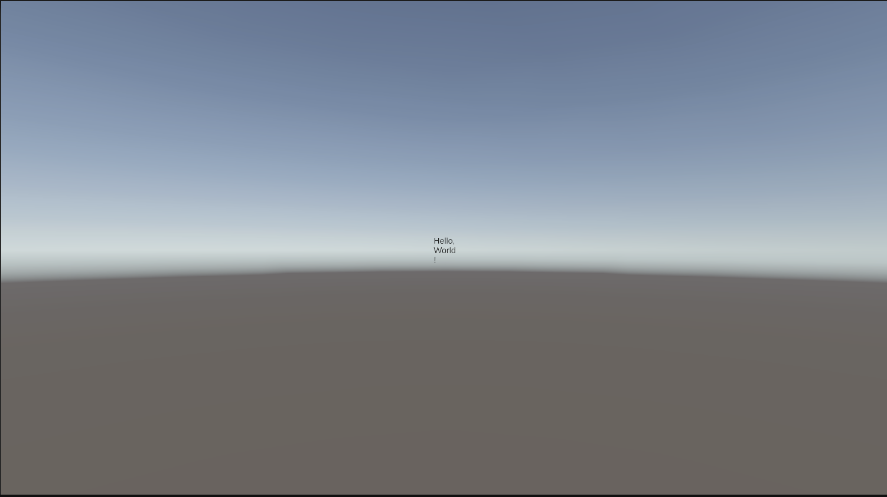
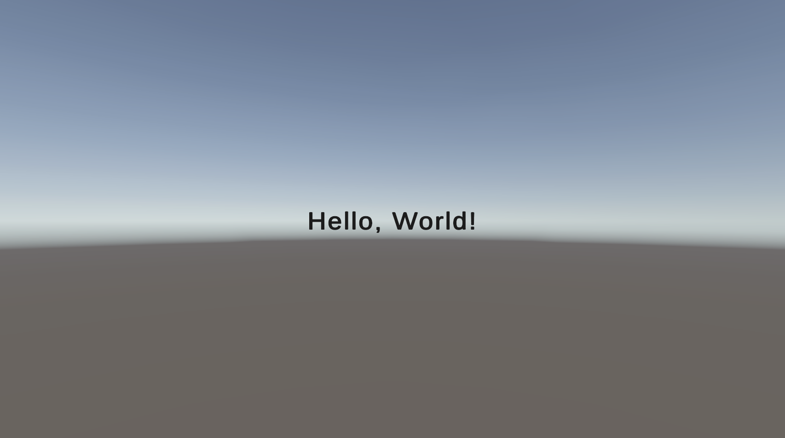

Now that we know a bit more about why UCGUI is the way it is you might be
wondering _"Ok cool, but how do I get a text or a button onto the screen? I know
how to do it via the editor and it is super fast so why would I even need 
this stupid libary?"_. That's a fair point, and we will show you in a second.

UCGUI separates its UIs into so called **Screens** which are essentially just 
a big content holder for all of your UI. Think of it like a mediation layer
between the canvas in your editor and your UI code. 
Instead of creating an empty GameObject for every UI elements manually and then adding it to the correct spot in the hierarchy you create your components inside of such a screen.

UCGUI's hierarchial model very closely mirrors the one you would build when using the editor to create some UI. 
UI components are often nested prefabs, allowing you to easily recreate them and move entire sub-hierarchies around.
UCGUI works very similarly. Components are instantiated and can be parented to one another using the `Parent` call and some additional behaviours to form an entire UI hierarchy completely usng code.

## Hello, World!

Let's create our first screen and add a *"Hello, World!"* text to it. For that we need a script which inherits from `SimpleScreen`.
In UCGUI screens are the bridge between the editor and your user interface.
In most cases they are the only script we actually assign and attach inside the editor.
All subsequent parts of the UI are then created within the screen itself.

First create a new script inheriting from `SimpleScreen` and name it something like `MyScreen`.
Next add `import UCGUI;` at the top and inherit from the SimpleScreen class like so:

```csharp
using UCGUI;
using UnityEngine;

public class MyScreen : SimpleScreen
{
    // ... 
}
```

:::tip

Almost all functionality in UCGUI is directly part of the `UCGUI` namespace, however there are some additional namespaces such as `UCGUI.Support` and `UCGUI.Service` which come with some addtional, optional functionality.

:::

:::important

Before we implement the missing methods attach your screen script to a (preferrably empty) GameObject in the scene hierarchy which is **hierarchially below a Canvas**. 
If you don't have a canvas yet, please add one.
This is a **crucial step** and your UI will **not appear properly** if you have not
set this up correctly.

Your hierarchy would then look something like this:
```title="Hierarchy Example"
Scene Root
└─ Canvas 
    └─ Empty :: MyScreen
└─ ...
```


:::

Your IDE or Unity might already alert you that SimpleScreen requires some members to be implemented. 
These should be three different methods: `Create`, `Initialize` and `GetCanvas`.

For our simple example we only need `Create` and `GetCanvas`, you can simply leave `Initialize` empty.

Now lets put the iconic *"Hello, World!"* onto the screen and we'll explore *why* and *how* this works afterwards.

```csharp title="MyScreen.cs"
using UCGUI;
using UnityEngine;
public class MyScreen : SimpleScreen
{

    public override void Create()
    {
        UI.Text("Hello, World!").Parent(canvas);
    }

    public override void Initialize() { }

    public override Canvas GetCanvas() 
    { 
        return GetComponentInParent<Canvas>(); 
    }

}
```

If everything is set up correctly in your hierarchy enter *Play Mode* you should now see your text getting drawn onto the screen, looking something like this:



The `Create` method is rather straight forward. 
You define any process creating a UI, in this case a text with our desired string, which is then drawn onto the canvas for you.
`UI.Text(string)` is simply a static builder function part of the UCGUI standard library to create a new GameObject with a [`TextComponent`](../../components/text-component.md) attached to it. \
This isn't enough though, you also need to parent the element to some place in the hierarchy.
As we'll see later on this can actually happen automatically, however for the sake of this example we explicitly call `Parent` on the text after creating it, parenting it to the some `canvas` variable. More on this in a second.
If an elment has no parent, meaning the parent is `null`, it will attach to the root of the scene hierarchy and thus will not be visible on the canvas.
This is where `GetCanvas` comes in. 
It runs before any of the other code and assigns the internal `canvas` member to a canvas in the scene based on whatever you return from it. 
This allows us to use the reference it when parenting our text element, making it appear on the screen! 
However, we could also reference any other object, even the screen itself (`this`), and the text would move through the hierarchy.

Although we have now managed to display some text to the screen, you might also be thinking _"Well this looks cool and all but the text is a bit small, it wraps weirdly and I want it to be bold..."_. Fair, and UCGUI offers solutions to all of your problems (_at least for this UI example, not in real life :/_).

This where the fluent pattern jumps in. 
UCGUI makes use of a generic extension class which allows all components to have certain shared function available to them.
`Parent` is one these functions, however many of them exist for many of the most commong operations, such as positioning, rotating or scaling an element in the hierarchy. 
However, some functions are also inside the classes themselves and thus naturally limited to their respective instances and their descendants. 
The recommended function style is to follow this pattern as it allows users to easily manipulate and iterate over their interface.

Let's expand on our previous example and address all of your hypothetical UI concerns:

```csharp
// ... 

public override void Create(){
    UI.Text("Hello, World!")
    .FitToContents()
    .FontSize(124)
    .Bold()
    .Parent(canvas);
}

// ...
```



_Ahhh_, much better! As you can see, the fluent pattern allows us to easily chain multiple styling options without having to re-reference the object multiple times.

Here `FitToContents`, `FontSize` and `Bold` are TextComponent-specific methods, whereas `Parent` can be universally applied to any component.

`FitToContents` simply tells the rect of the text to adapt to the preferred size of the text itself, removing our weird line-wrap issues from before. 
`FontSize` and `Bold` should be self-explanatory.

Perfect. Now we know how to display some basic text on the screen!
A small recap of what we have learnt so far:

- Screens server as a mediation layer between the editor and your UCGUI interface and can be initialized with a reference to the parent canvas.
- UCGUI uses the fluent pattern for almost all of the configuration of components, allowing for quick and simple modifications.
- The static `UI` class offers a lot of preset builders, like `UI.Text(...)`, for quick creation of UCGUI's default components.
- Setting the parent of an element allows us to define its location in the UI hierarchy.
