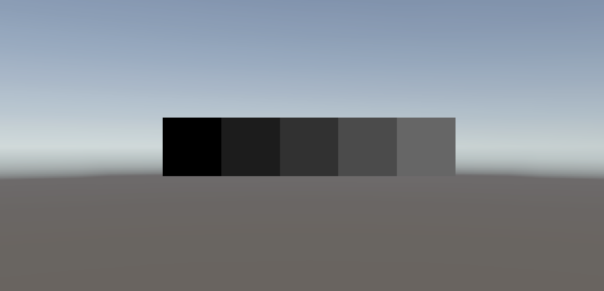
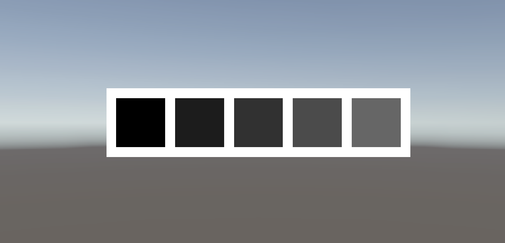
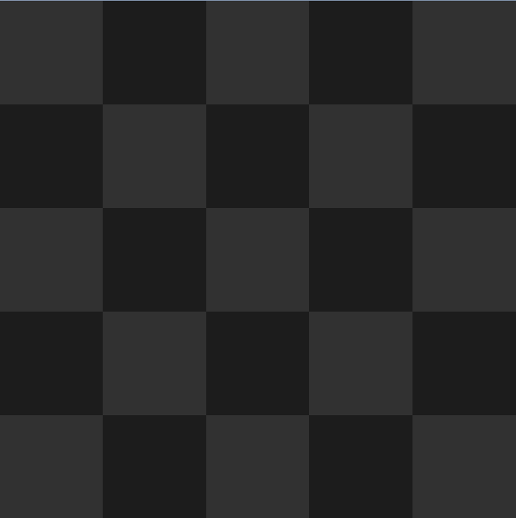

Most user interfaces require some sort of dynamic layout system. Containers need to adjust
to the size of their parents, and elements need to be properly spaced within them.

Unity offers some basic tools for this and UCGUI mostly builds on top of them.
Similar to other UI building tools UCGUI offers standard flexible directional layout containers:

## VStack and HStack

The V(ertical) and H(orizontal) Stacks are essential to most UIs. They lay out elements 
in their respective direction automatically, either aligning content the edges or to the relative centers.

They are very useful to quickly create some evenly spaced content without the need for manual positioning.
Let's take a look at a simple example first.

```csharp
UI.HStack(stack => {
    
    for (int i = 0; i < 5; i++)
        stack.Add(
            UI.Image(new Color(i * .1f, i * .1f, i * .1f))
        );

}).Parent(canvas);
```



As we can see, the HStack automatically aligns our color gradient images horizontally.

You might notice however that the images are very tightly packed together and you want your color gradient 
to feel more like a piece of paper with some color blocks on it.

We can change the distance _between the individual elements_ with the **'spacing'** value of the HStack when instantiating it.

Additionally, the HStack itself is exactly the size of the its contents. If we want it to have 
some outer **margins / padding** we need can manually specify that as well.

One more thing: All layouts indirectly inherit from the Image, meaning we can simply call '.Color' or '.Image' on them to fill them in!

Let's put all of these things together to create a more advanced layout for our gradient.

```csharp
int spacing = 20;
int paddingAmount = 20;
UI.HStack(spacing, stack => {

    for (int i = 0; i < 5; i++)
        stack.Add(
            UI.Image(new Color(i * .1f, i * .1f, i * .1f))
        );

    stack.Padding(PaddingSide.All, paddingAmount);
})
    .Color(Color.white) // inherited from ImageComponent
    .Parent(canvas);
```



_The VStack works analagously, just in the vertical instead of the horizontal direction._

:::tip

There is nothing stopping you from nesting these to create more complex layout combinations :).
To find out more about what these stacks can do visit their respective pages: 
[HStack](../../components/layouts/hstack-component.md) / [VStack](../../components/layouts/vstack-component.md).

:::

## Grid

The GridComponent is a simple wrapper around Unity's built in grid layout.
The builder can be configured to have either a fixed column or row count:

```csharp
UI.Grid(GridLayoutGroup.Constraint.FixedColumnCount, 5, grid =>
{
    grid.CellSize(100, 100);
    for (int y = 0; y < 5; y++)
        for (int x = 0; x < 5; x++)
            grid.Add(UI.Image((x + y) % 2 == 0 ? Color.gray2 : Color.gray1));
}).Parent(canvas);
```

Grids always enforce a certain cell size. You can change it but it defaults to 100x100.




:::note

There are also some other layouts in UCGUI such as the SwitchLayout (which can dynamically switch its orientation between horizontal 
and vertical), however they are not too relevant for this rather basic tutorial.

:::

What we have learnt in this section:
- HStack and VStack are powerful tools, allowing you to easily distribute elements.
- The Grid aligns objects in a ... _you guessed it_ ... grid!
