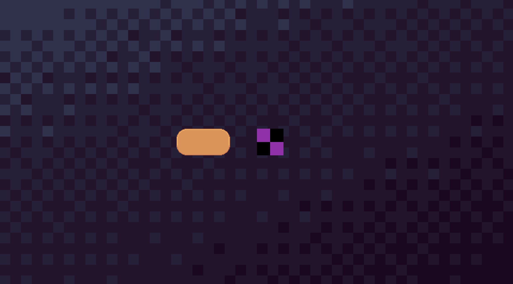

In our previous example we only used some simple colors and the default font
for our components. This won't cut for most use cases as you most probably want your
own font, images, button, etc.

As UCGUI has no visual no editor to do any of those things, one naturally might
come to the conlcusion that there needs to be some sort of functionality
to achieve the same result. _Indeed!_ 

## Text Asset Customization

### Naive Loading

Before we dive into some more convenient workflows, let's start with some very simple,
but naive, examples.

Suppose you want to change the font of your text. No special request; no special answer.
Changing the font is as simple as calling `.Font(...)` on any TextComponent! 
However, how do we tell the the function _where_ to grab our font asset from? UCGUI makes
use of [TextMeshPro](https://docs.unity3d.com/Packages/com.unity.textmeshpro@2.1/manual/index.html) under the hood for all text-based elements, and thus a [TMP_FontAsset](https://docs.unity3d.com/Packages/com.unity.textmeshpro@2.0/api/TMPro.TMP_FontAsset.html) 
is required to change the font of your text. 

As you might know, the [Resources API](https://docs.unity3d.com/6000.3/Documentation/ScriptReference/Resources.html) allows for dynamic loading of such anything which is located
in the your `<Project>/Assets/Resources/` folder. We can make use of it to set the font of 
our text:

```chsarp
    UI.Text("Hello, World!")
    .Font(
        // Loads "<ProjectName>/Assets/Resources/Font/FancyFont.asset"
        Resources.Load<TMP_FontAsset>("Font/FancyFont")
    )
    .Parent(canvas);
```

This works, but we quickly run into an issue when trying to re-use the same font for multiple text components.
We could store a reference to the asset and then apply it to all texts but this is also tedious and you need some centralized
place to store the font, allowing you to access it. Also too much effort.

### Advanced Loading

The TextComponent has a built in solution: `GlobalFont` is a static member (and method) which can be initialized 
**once**, and then applies the font automagically to every TextComponent which is instantiated afterwards. 
This removes our '.Font' calls and we never have to remember to apply it to every single text, button, label, textfield, etc.

```csharp

TextComponent.GlobalFont = Resources.Load<TMP_FontAsset>("Font/FancyFont");
for (int i = 0; i < 5; i++){
    UI.Text($"Hello, {i}").OffsetY(i * -40).Parent(canvas);
}
```

Using this technique, **all** texts in the example above will have our custom font applied, whilst only requiring 
a loading overhead once.

:::warning

UCGUI heavily recommends using the GlobalFont variant as loading from the Resources for every text instantiation 
is **very performance heavy**.

:::

## Image Asset Customization

Images are a bit more complex to get right as you probaly load _way_ more images than fonts throughout your game.

UCGUI offers a simple way of loading images into your game. Again you can use 'Resouces.Load', but 
has a built-in wrapper which also does nice quality of life side-effects.

The `ImageService` class wraps the 'Resouces' functionality by allowing for a fallback if a certain texture or sprite
cannot be found. This often helps to quickly identify where something has gone wrong, or assets are still missing.
`Defaults.Services.MissingTexture2DLocation` can be set to a path relative to the Resources folder to fallback to a specific 
Texture2D when an attempt at grabing an invalid asset was made; it will default to _'Assets/Resources/missing'_. 
Furthermore, `ImageService.GetSprite` and `ImageService.GetSpriteDirectly()` can be used to load 'Default' or 'Sprite' images 
from your folder structure. **Both** load **relative to _'Assets/Resources/Textures/'_**!

Let me show you what using them could look like:

```csharp
// first, define a fallback image for invalid paths
ImageService.MissingTextureLocation = "Textures/missing"

// "<Project>/Assets/Resources/Textures/wallpaper" with ImageType 'Default'
UI.Image(ImageService.GetSprite("wallpaper")).Maximize().Parent(canvas);

// "<Project>/Assets/Resources/Textures/9-sliced-rectangle" with ImageType 'Sprite'
UI.Image(ImageService.GetSpriteDirectly("9-sliced-rectangle"))
    .Size(200, 100)
    .ImageType(Image.Type.Sliced)
    .PixelsPerUnitMultiplier(0.1f)
    .OffsetX(-200)
    .Parent(canvas);

// "<Project>/Assets/Resources/Textures/missing" with ImageType 'Default'
UI.Image(ImageService.GetSpriteDirectly("invalid-path")).OffsetX(50).Parent(canvas);
```



As you can see, UCGUI correctly loaded our wallpaper and the sprite for our rectangle. However, when we 
tried loading an invalid path to an image (either because we tried to load a Sprite but the image was marked as Default, vice versa, etc.)
UCGUI displays the texture defined as your 'Missing Texture'. 

For the 9-Sliced image we have to apply a slightly differnt flow to have it be properly displayed in our user interface.
Most importantly we need to load it **directly** (as the method states), instead of indirectly so we can 
keep its 9-sliced configuration and options. Then, we need to tell the renderer to treat it as a sliced
image and how 'strong' the slicing should be.
If you are unsure of what exact value to use the the pixels per unit multiplier, try building your UI once and then
tweaking the value in the editor. It can be hard to guess what exact values create your desired look, and this is 
where UCGUI reaches its limits in terms of a lack of visual feedback of your UI elements.

:::tip

It is recommended to set your missing texture as early as possible as this helps you with debugging. 
If no missing texture is defined or the path to it is invalid, UCGUI will have **no** internal 
fallback and null will be passed around.

:::

What we have learnt this section:
- Why we use a GlobalFont reference to set our fonts, and in which ways we can set it.
- How we can load different types of images.
    - Why extensions such as 'ImageType' or 'PixelsPerUnitMultiplier' might be necessry when dealing
    with 9-sliced sprites.
    - How the MissingTexture2DLocation can help us catch invalid textures.

