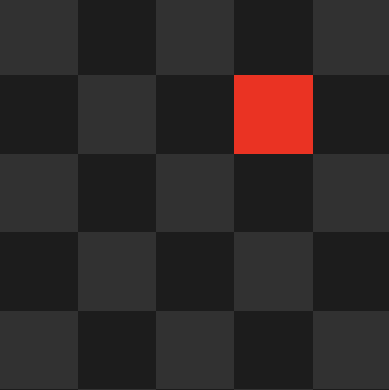
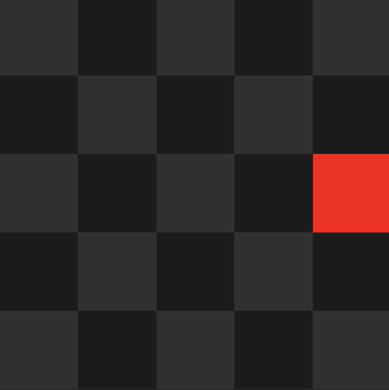

Now that we know how to create our first little 'Hello, World!' example
we need to know how to position our elements at different parts
of the screen, not just the center.

Let's go over some of the basic positioning commands and what they do.
We will use a simple rectangle to show how the different commands and their potential
combinations affect the positioning of objects within their parent's bounds.
The parent is sized exactly to the scale of the grid. In this specific example 
the rectangle is 100x100 and the parent 500x500.

> Default at (0,0)


### `Pos(Vector2) / Pos(float, float)` 
sets the anchored position of the element. The anchored position always describes the 
position coordinates relative to the objects **direct** parent. The first coordinate describes the x, the second the y direction.

> Pos(100, 100) 



### `Offset(Vector2) / Offset(float, float)` 
offsets the anchored position of an element relative to its current position.
You can also use the shorthands `OffsetY(float)` and `OffsetX(float)` to add offset in only one specific dimension.

> Pos(100, 100) + Offset(0, -50) = (100, 50)


### `Pivot(PivotPosition, bool?) / PivotPosition(Vector2, bool?)`
sets the pivot of the object. Can be a combination of fixed pivots in the vertical 
(`Upper`, `Middle`, `Lower`) and horizontal (`Left`, `Center`, `Right`) directions, or
a custom Vector2.

Set the bool `alsoMoveAnchor` to additionally move the [anchor](#anchoredtopivotposition) of the object itself.

> Pivot(PivotPosition.MiddleRight, alsoMoveAnchor=true) 


> Pivot(PivotPosition.MiddleRight, alsoMoveAnchor=false) 


:::important

As you can see in the image above, the square didn't actually move to the right edge
after we set its pivot. This is because we **only** set the pivot point, not the anchor point. As the RectTransform
did not change its coordinates, it as to visually reflect its new interpretation
of a right-centered pivot at (0,0). This results in the _right edge_ now being at 
the origin, seamingly shifting the square to the left.

::::

### `AnchoredTo(PivotPosition)`

sets the anchored position of the object itself.

_As you can see in the example below, moving **only** the anchor results 
in the origin aligning with the right edge of its parent. As the pivot
is centered on the square, this leads to use only seeing the left half of it as the
right half is out of bounds._

> AnchoredTo(PivotPosition.MiddleRight) 


:::tip

Combining these simple, yet powerful, commands allows for arbitrary positioning of your
objects in your UI. It's best to just start and try out some combinations and see where it 
gets you.

Below you can expand the box to find the code for this setup. Simply modify the positioning
of the red square and try understanding how each command affects its position!

<details>
    <summary>Code for this Setup</summary>
    ```csharp
        /* Grid Background */
        UI.Grid(GridLayoutGroup.Constraint.FixedColumnCount, 5, grid =>
        {
            grid.CellSize(100, 100);
            for (int y = 0; y < 5; y++)
                for (int x = 0; x < 5; x++)
                    grid.Add(UI.Image((x + y) % 2 == 0 ? Color.gray2 : Color.gray1));
        }).Parent(canvas);
        
        /* Parent */
        var parent = UI.Image(Color.clear).Parent(canvas).Size(500, 500);

        /* Square */
        UI.Image(Color.red)
            // TODO Positioning
            .Parent(parent);
    ```

    For more information about the `UI.Image` initializer and other UI elements
    continue following the tutorial :)
</details>
:::

Let's go over what we have learnt in this section:
- Basic positioning commands for UI elements
- Combining positioning commands can create new visual states.
- Sneak peek into `UI.Image` and `UI.Grid`.
