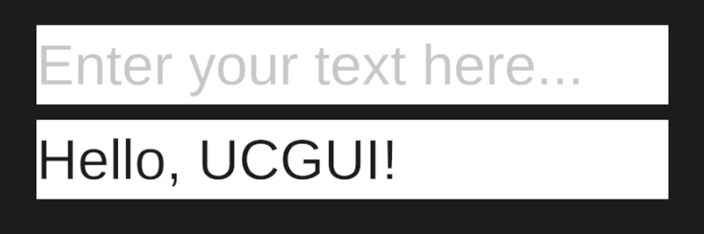

## Description

InputComponents often need be able to stand out, alerting the user that a potential action is required
by them. Thus, styling them is crucial. 

UCGUI applies the native **Default** style when an InputComponent is created.

It styles both the user-text and placeholder with the [Primary and Secondary TextStyle](./text-style.md) respectively, as well as 
turning down the alpha of the placeholder.

This leads to a very simple looking input field, waiting for you to be customized to your needs.

:::tip

You can directly override the `Default` style, removing the need to manually call `.Style()` every time you 
create an InputComponent. You can do this by [redefining it](./abstract-style.md#redefinition-of-existing-styles).

:::

## Implementation

:::note

[**InputStyle.cs**](https://www.github.com/GiorgioKalmund/UCGUI/tree/main/Runtime/Components/Style/InputStyle.cs)

::: 

