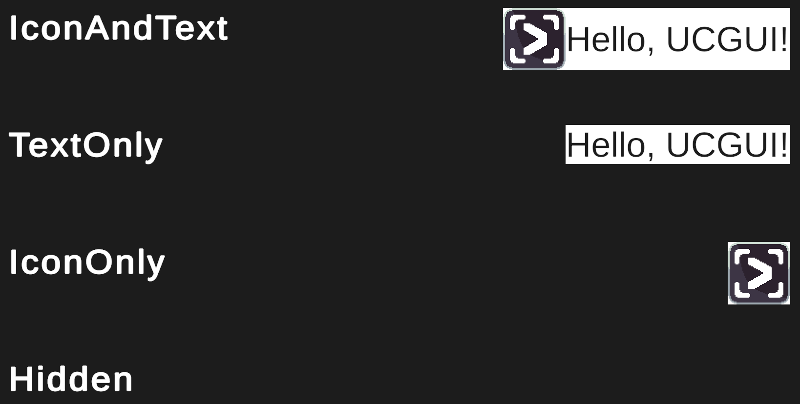

## Description

As labels are meant to act as a simple content holder for a combination of an image / icon and some text the default styles allow you
to modify their visibility.

Labels have four built-in display styles:

1. **IconAndText** 
(_Default_)
2. **IconOnly**
3. **TextOnly**
4. **Hidden**

They are pretty self-explanatory and, as a reader familiar with SwiftUI might notice, pretty much
mirror [their SwiftUI counterparts](https://developer.apple.com/documentation/swiftui/labelstyle/).

:::info

_SwiftUI's default is 'Automatic' which also adapts the visibility of the icon and text according the context and the available space in the hierarchy. 
This is an interesting idea and might be explored in the future, however most non-mobile GUI contexts are statically sized and thus the style
can be simply chosen when developing. UCGUI is currently still mostly built for static layouts, thus adapting to a change in size is currently still in the hands of the 
GUI developer._

:::

However, contrary to the button, these styles do not apply any padding or spacing by default.
If you want this to be the case for all of your labels, take a look at [how to override these styles](./abstract-style.md#redefinition-of-existing-styles).

:::warning important

Be aware that by changing `LabelStyle.IconAndText`, you might influence the appearance of your buttons as they inherit from 
labels. This might be what you want, just a heads up. 

:::tip

Buttons inheriting from labels also allows you to apply these LabelStyles 
to buttons and they will work as long as your button only makes use of its default text and image subcomponents :)

:::

:::

## Implementation

:::note

[**LabelStyle.cs**](https://www.github.com/GiorgioKalmund/UCGUI/tree/main/Runtime/Components/Style/LabelStyle.cs)

::: 

